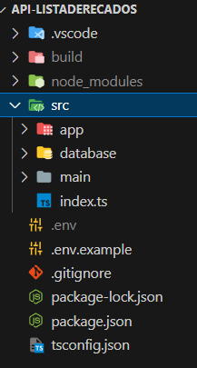
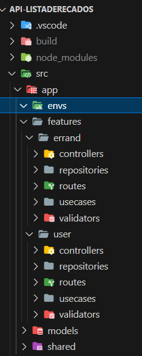

# Api-listaDeRecados
Projeto de back-end onde criei uma api com Typescript, utilizando TypeORM.

## :memo: Descrição
A API Lista de Recados é uma aplicação RESTful desenvolvida em Node.js, seguindo o paradigma de Programação Orientada a Objetos (POO) e utilizando TypeORM para a integração com um banco de dados relacional (PostgreSQL).

O projeto foi estruturado com base nas melhores práticas de arquitetura de código, garantindo organização, escalabilidade e manutenção eficiente.

Funcionalidades
Gerenciamento de Usuários: Cadastro e listagem de usuários.
Gerenciamento de Recados: Criação, listagem, edição e exclusão de recados vinculados a um usuário.
Essa API oferece uma base sólida para aplicações que necessitam de um sistema de anotações ou lembretes, proporcionando uma interface confiável para a manipulação de dados.

 
 ### :computer: Visualização da Arquitetura
 

 ### :computer: Visualização das Features
 


## :books: Funcionalidades

* Todas as rotas possuem validação dos parâmetros recebidos, retornando uma mensagem de erro e status adequado para a situação.
* Todas as rotas que possuem consulta à alguma informação (GET, PUT, DELETE), validam se o recurso acessado existe antes de efetuar a ação, retornando uma mensagem de erro e status adequado para a situação.
* O sistema aceita cadastro de novos usuários, faz a listagem de todos os usuários e filtra usuário por id.
* Os usuários necessitam realizar um login para que tenham acesso as funcionalidades na aplicação.
* Os usuários podem criar, listar, editar e deletar (CRUD) os seus recados.

## Installation

```bash
$ npm install
```
## Running the app

```bash
# development
$ npm run dev
```

##  :wrench: Tecnologias utilizadas

[](#)
[](#)
[](#)
[](#)
[](#)
[](#)


## :dart: Status do projeto
:construction: Projeto em construção :construction:


## :books: License

Copyright © 2023 Eva Tavares
This project is [MIT](license) licensed.

```

```
